\
\
\
\

深度学习
========

本周的主要工作是搭建神经网络完成了猫的识别和利用上周所学正则化、梯度检验等搭建神经网络针对神经网络的过拟合进行优化。其中过拟合优化的主要任务为：通过加入正则化对数据进行分类，提高训练和测试的准确度。

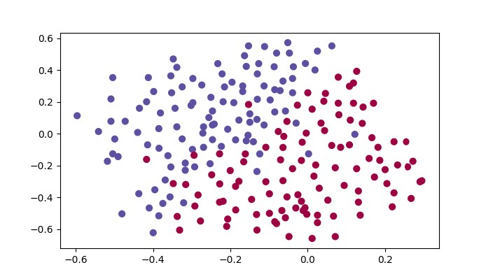{width="\\linewidth"}

参数的初始化
------------

权重参数初始化主要分三种：初始化为零，随机初始化，抑制梯度异常初始化。选择不同初始化方式最后网络的成本和训练集与测试集的准确度有非常大的差距。针对已经搭建的三层神经网络，接下来限制神经网络为无正则化参数加入分别对三种不同初始化方式的结果进行测试。

### 初始化为零

对神经网络中所有权重参数初始化为零，然后进行检测训练网络的训练性能。

网络运行后无论经过多少次的迭代，成本函数均不变，训练集与测试集的准确度均非常低，反映了神经网络根本没有进行学习。且由神经网络输出的最终的分类结果可以看到，网络并没有成功运行，没有达到预期结果。

实验结果如图所示：

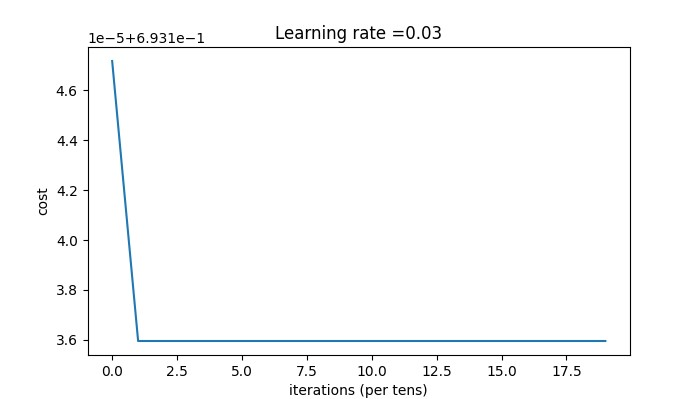{width="\\linewidth"}

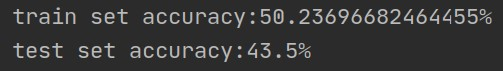{width="\\linewidth"}

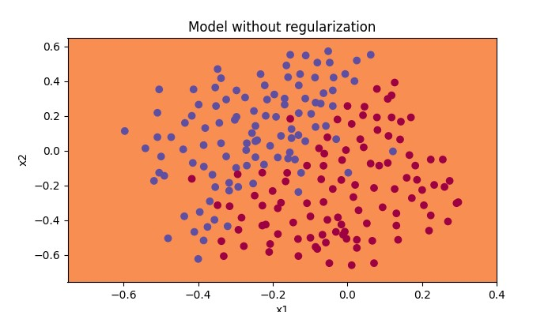{width="\\linewidth"}

### 随机初始化

对神经网络中所有权重参数随机进行初始化，然后进行检测训练网络的训练性能。在随机初始化之后，每个神经元可以开始学习其输入的不同功能。

网络运行后经过多次的迭代，成本函数下降非常明显，训练集与测试集的准确度也较之前有大幅度的提高，且由神经网络输出的最终的分类结果可以看到，神经网络可以将数据集成功进行分类，但是在两种数据的交界点处，还有一定的误差，需要进一步的优化。

实验结果如图所示：\
\
\

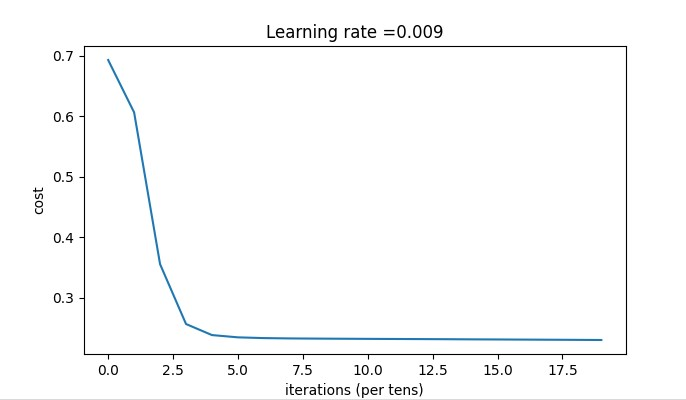{width="\\linewidth"}

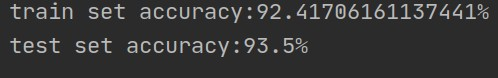{width="\\linewidth"}

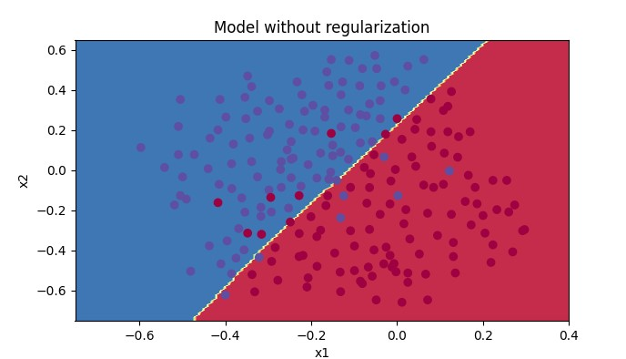{width="\\linewidth"}

在随机初始化参数时，需要特别注意参数大小的选取，不能太大或者太小，否则将会导致梯度消失或者梯度爆炸。

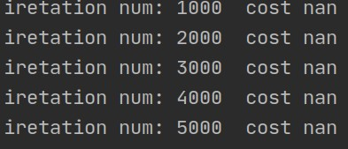{width="\\linewidth"}

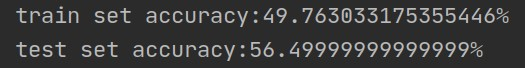{width="\\linewidth"}

### 抑制梯度异常初始化

对神经网络中所有权重参数使用抑制梯度异常的方式进行初始化，然后检测训练网络的训练性能。在随机初始化之后，每个神经元可以开始学习其输入的不同功能。

与随机初始化参数相比，到达相同的准确度，抑制梯度异常的方式需要的迭代次数相比前者大幅度减小，仅需要很少的迭代次数即可，并且增加迭代次数和前者相同，最终准确度比随机初始化参数要高。由神经网络输出的最终的分类结果可以看到，神经网络可以将数据集成功进行分类，并且在交界点处的分类有相应的提升。

实验结果如图所示：

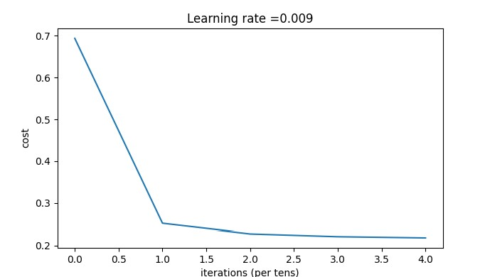{width="\\linewidth"}

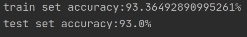{width="\\linewidth"}

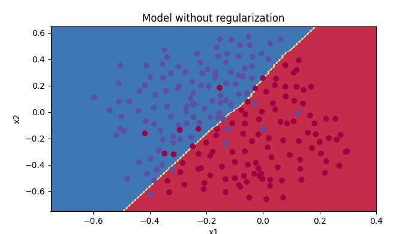{width="\\linewidth"}

正则化
------

在深度学习中，如果数据集没有足够大的话，可能会导致一些过拟合的问题。过拟合导致的结果就是在训练集上有着很高的精确度，但是在遇到新的样本时，精确度下降会很严重。为了避免过拟合的问题，除了加大数据集还有就是采用正则化。

在本次实验，参数初始化采用抑制梯度异常的方式，分别对比无正则化和加入正则化后的结果。

### 不使用正则化

设置学习速率为0.08，不使用正则化，进行20000次迭代，对比最后的输出结果可以非常明显的看出，成本下降非常快，且分割曲线有了明显的过拟合特性。

实验结果如图所示：

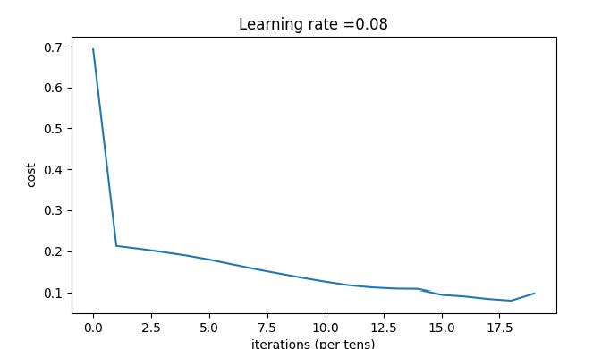{width="\\linewidth"}

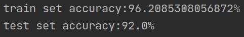{width="\\linewidth"}

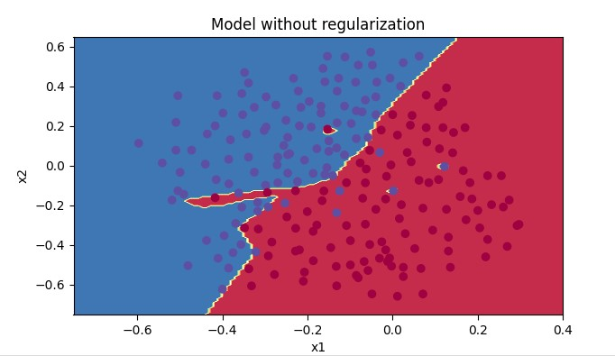{width="\\linewidth"}

### 使用L2正则化

在保证上述参数均不改变的情况下，仅加入L2正则化，观察最后输出结果。其中L2正则化主要公式为：
$$J(\omega,b)=\frac{1}{m}\sum_{i = 1} ^mL(y_1^i - y^i)+\frac{\lambda}{2m}||\omega||_2^2$$
其中$||\omega||_2^2=\sum_{j=1} ^{n_x} \omega_j^2$

np.sum(np.square(Wl))

在前向传播中计算成本函数需要对所有参数进行处理，主要代码如下：

在反向传播中同样需要对所有参数进行公式上的处理。

实验结果如下：

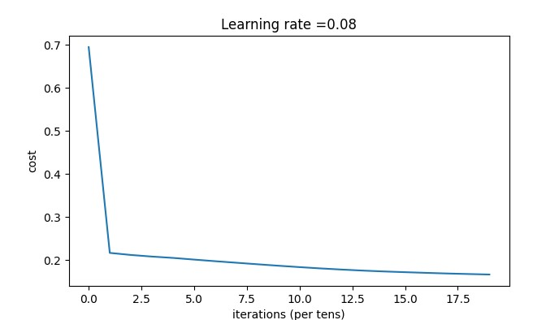{width="\\linewidth"}

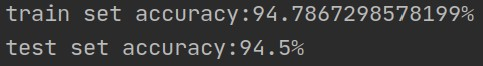{width="\\linewidth"}

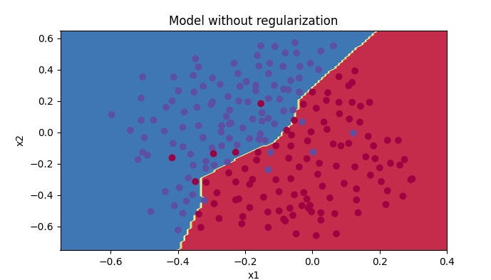{width="0.95\\linewidth"}

由实验结果可以非常明显的看出，成本函数非常平缓的下降，训练集和测试集的准确度差值非常小，并且对于最后的分类结果可以看出模型非常好的解决了过拟合问题。

(引用自论坛)$\lambda$的值是可以使用开发集调整时的超参数。L2正则化会使决策边界更加平滑。如果$\lambda$太大，也可能会"过度平滑"，从而导致模型高偏差。L2正则化实际上在做什么？L2正则化依赖于较小权重的模型比具有较大权重的模型更简单这样的假设，因此，通过削减成本函数中权重的平方值，可以将所有权重值逐渐改变到到较小的值。权值数值高的话会有更平滑的模型，其中输入变化时输出变化更慢，但是你需要花费更多的时间。L2正则化对以下内容有影响：

成本计算   ： 正则化的计算需要添加到成本函数中

反向传播功能 ：在权重矩阵方面，梯度计算时也要依据正则化来做出相应的计算

重量衰减  ：权重被逐渐改变到较小的值。

### 使用Dropout正则化

Dropout的原理就是每次迭代过程中随机将其中的一些节点失效。当我们关闭一些节点时，我们实际上修改了我们的模型。背后的想法是，在每次迭代时，我们都会训练一个只使用一部分神经元的不同模型。随着迭代次数的增加，我们的模型的节点会对其他特定节点的激活变得不那么敏感，因为其他节点可能在任何时候会失效。

实验结果如下：

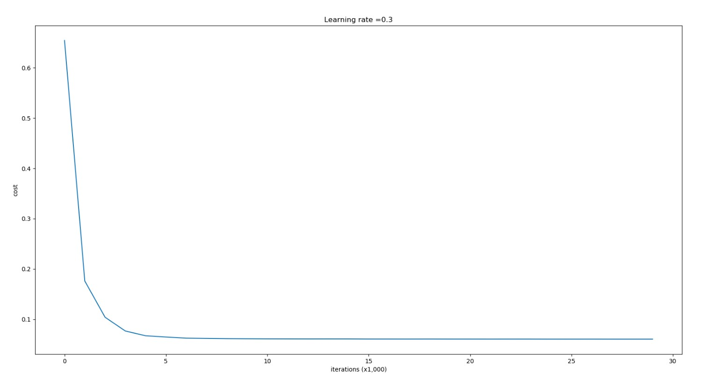{width="\\linewidth"}

{width="\\linewidth"}

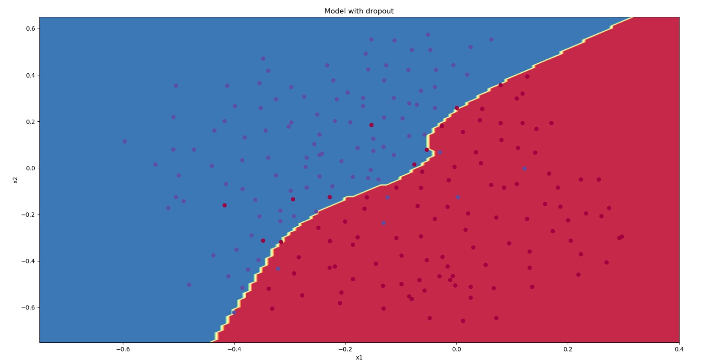{width="0.95\\linewidth"}

由最后的结果可以看到，正则化会把训练集的准确度降低，但是测试集的准确度提高了。

LeetCode
========

二进制求和
----------

给你两个二进制字符串，返回它们的和（用二进制表示）。输入为非空字符串且只包含数字1和0。

每个字符串仅由字符 '0' 或 '1' 组成。

字符串如果不是 \"0\" ，就都不含前导零。

class Solution: def addBinary(self, a, b): if not a or not b: return a
or b a, b, ans = a\[::-1\], b\[::-1\], \[\] i = j = carry = 0 while i \<
len(a) or j \< len(b) or carry: n1 = int(a\[i\]) if i \< len(a) else 0
n2 = int(b\[j\]) if j \< len(b) else 0 carry, cur = divmod(n1 + n2 +
carry, 2) ans.append(str(cur)) i, j = i + 1, j + 1 return
".join(ans\[::-1\])

爬楼梯
------

假设你正在爬楼梯。需要 n 阶你才能到达楼顶。每次你可以爬 1 或 2
个台阶。你有多少种不同的方法可以爬到楼顶呢？注意：给定 n 是一个正整数。

爬到第n楼的方法，为爬到第n-1楼和n-2楼的方法之和

因为爬到n-1楼后，再爬1楼就能到达n楼

爬到n-2楼同理

因此只需初始化爬到1楼和爬到2楼分别有多少种方法，便可以推导出爬到n楼的方法

class Solution: def climbStairs(self, n): first = 1 second = 2 ans = 0
for i in range(2, n): ans = first + second first = second second = ans
return max(n, ans)

合并两个有序数组
----------------

给你两个有序整数数组 nums1 和 nums2，请你将 nums2 合并到 nums1 中，使
nums1 成为一个有序数组。

初始化nums1和nums2的元素数量分别为m和n。

你可以假设nums1有足够的空间（空间大小大于或等于m +
n）来保存nums2中的元素。

class Solution: def merge(self, nums1, m, nums2, n): \"\"\" Do not
return anything, modify nums1 in-place instead. \"\"\" i = m + n - 1 a =
m - 1 b = n - 1 while b \>= 0: if a \>= 0 and nums1\[a\] \> nums2\[b\]:
nums1\[i\] = nums1\[a\] a -= 1 else: nums1\[i\] = nums2\[b\] b -= 1 i -=
1 return nums1

杨辉三角
--------

给定一个非负整数 numRows，生成杨辉三角的前 numRows 行。

class Solution: def generate(self, numRows): res = \[\] if numRows == 0:
return res res.append(\[1\]) if numRows == 1: return res for i in
range(1, numRows, 1): tmp = \[\] for j in range(i+1): if 1 \<= j \< i:
tmp.append(res\[i-1\]\[j-1\] + res\[i-1\]\[j\]) else: tmp.append(1)
res.append(tmp) return res
